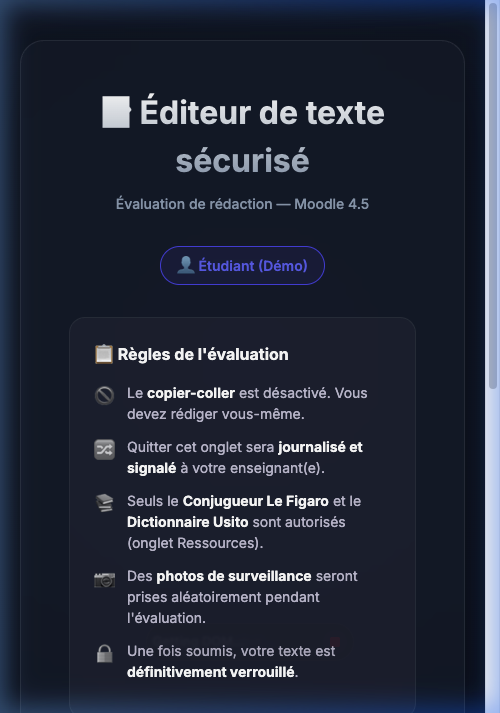
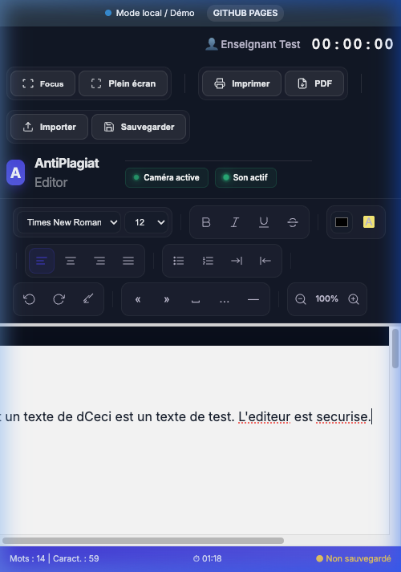
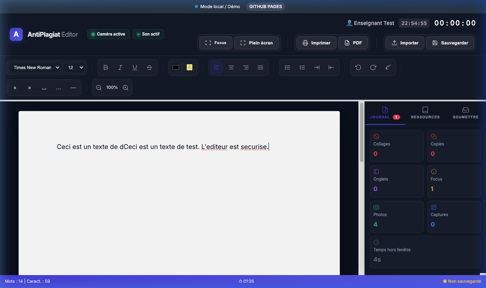
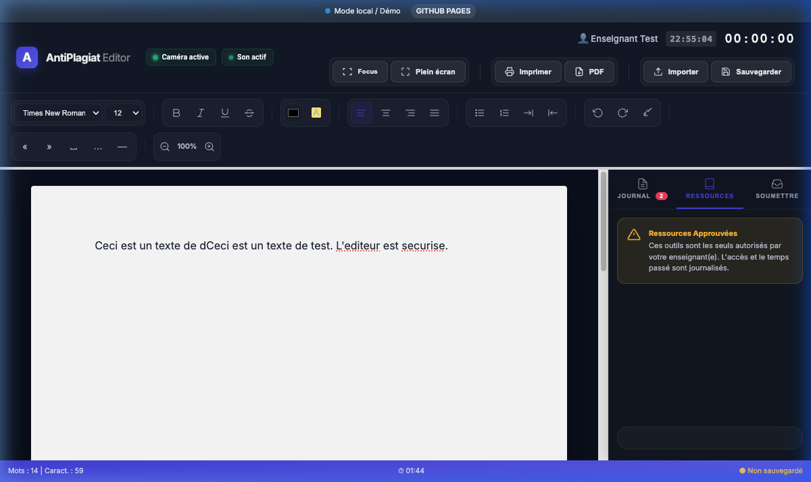
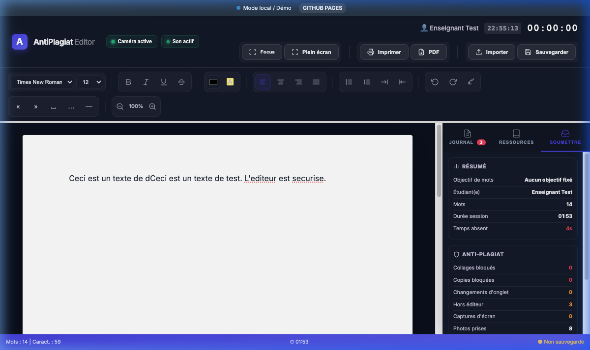
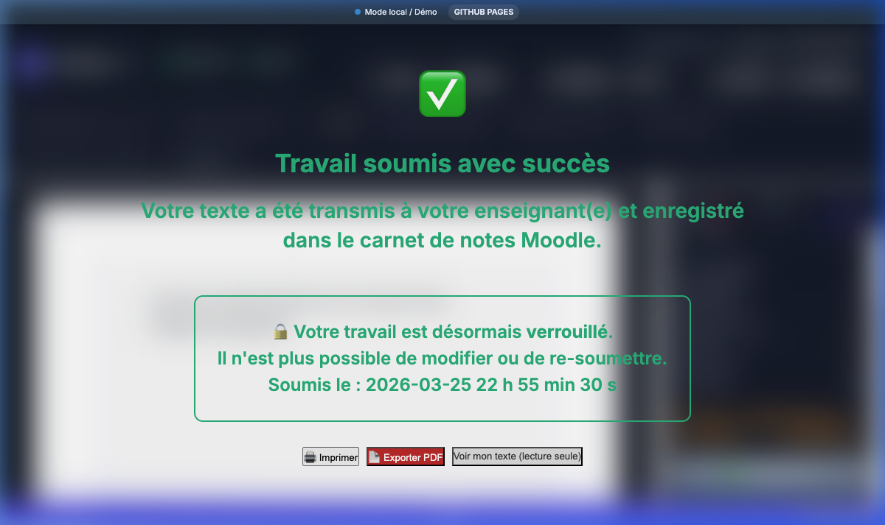

# 📘 Guide de l'Enseignant : Éditeur AntiPlagiat Sécurisé

Ce guide est conçu pour vous aider à comprendre et à utiliser rapidement l'**Éditeur AntiPlagiat** au sein de vos activités Moodle. Cet outil permet de sécuriser les évaluations de rédaction en surveillant l'intégrité du travail de l'étudiant en temps réel.

---

## 1. Accueil et Règles de l'Évaluation
Lorsque l'étudiant lance l'activité, il arrive sur un écran de bienvenue qui lui rappelle les règles strictes de l'épreuve.

**Ce que l'étudiant doit savoir :**
*   **Copier-coller désactivé** : L'étudiant ne peut pas importer de texte externe.
*   **Verrouillage** : Une fois le travail soumis, plus aucune modification n'est possible.
*   **Consentement** : L'étudiant doit accepter les règles et indiquer son nom pour pouvoir commencer.

---

## 2. L'Interface de Rédaction
L'éditeur offre une interface épurée, similaire à un traitement de texte moderne, mais entièrement contrôlée.

**Fonctions clés pour l'étudiant :**
*   **Barre d'outils** : Formatage de base (Gras, Italique, Listes, Police, Taille).
*   **Horloge en temps réel** : Affiche l'heure actuelle ainsi que le temps écoulé depuis le début de la session.
*   **Sauvegarde automatique** : Le texte est enregistré toutes les 30 secondes vers Moodle et la base de données locale.
*   **Compteur de mots** : Visible en bas à gauche pour suivre la progression par rapport à l'objectif.

---

## 3. Le Journal de Surveillance (Sûreté)
C'est le cœur du système anti-plagiat. Chaque action suspecte est enregistrée dans l'onglet **Journal**.

**Événements surveillés :**
*   **Sortie de fenêtre (Focus loss)** : Si l'étudiant clique sur une autre application ou un autre onglet, l'événement est marqué en rouge avec le temps exact passé "hors fenêtre".
*   **Collages (Paste)** : Tentatives (bloquées) d'importation de texte.
*   **Photos/Captures** : Des photos webcam et captures d'écran sont prises aléatoirement pour valider l'identité et l'environnement de l'étudiant.

---

## 4. Ressources Autorisées
Pour aider l'étudiant sans compromettre la sécurité, deux ressources externes sont intégrées directement dans l'interface : **Le Conjugueur** et **Le Dictionnaire Usito**.

*   L'accès à ces sites est consigné.
*   L'étudiant ne quitte jamais l'éditeur sécurisé pour consulter ces outils.

---

## 5. Processus de Soumission
Avant de soumissionner, l'étudiant peut consulter l'onglet **Soumettre** pour voir un résumé global de son activité.

**L'étudiant peut voir :**
*   Le nombre de mots rédigés.
*   Le nombre de alertes (collages, sorties de focus).
*   La durée totale de sa session.

---

## 6. Confirmation et Verrouillage
Une fois que l'étudiant clique sur "Soumettre", un message de confirmation géant s'affiche en vert.

**Résultat final :**
1.  Le texte est transmis de manière définitive au carnet de notes Moodle.
2.  L'éditeur passe en **mode lecture seule** (impossible d'éditer).
3.  L'étudiant peut télécharger son travail en **PDF** ou l'imprimer pour ses propres archives.

---

## 💡 Conseils pour l'Enseignant
*   **Vérification des notes** : Le texte est stocké dans le champ `suspend_data` de l'activité SCORM dans votre rapport Moodle.
*   **Analyse du journal** : En cas de doute sur l'intégrité, consultez les "Temps hors fenêtre" dans le journal de l'étudiant.
*   **Configuration** : Vous pouvez ajuster les couleurs ou les logos via le fichier `config.json` si nécessaire.

---
*Document généré automatiquement pour l'Éditeur AntiPlagiat — Mars 2026*
