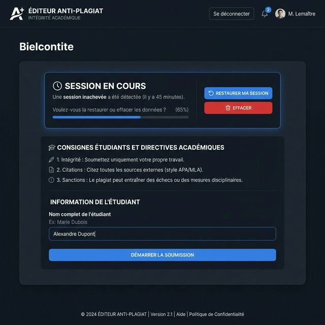
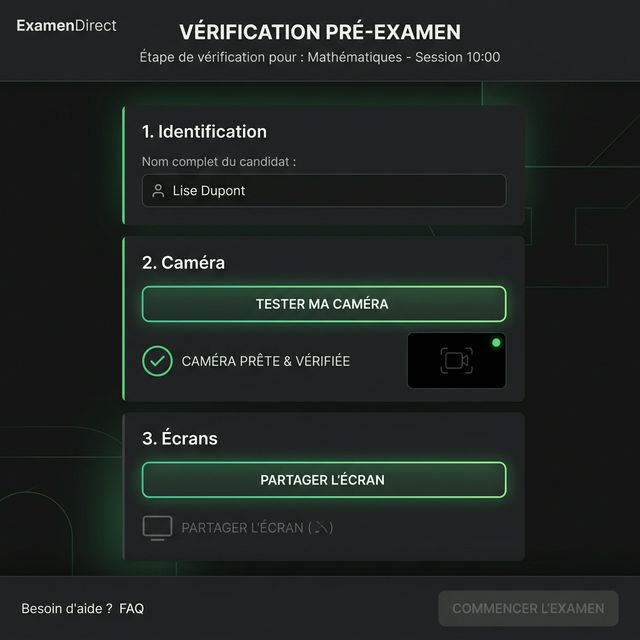
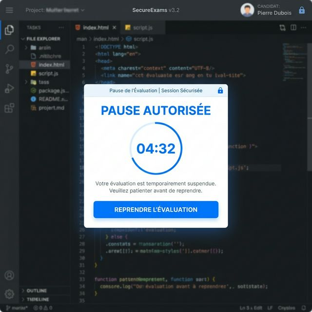
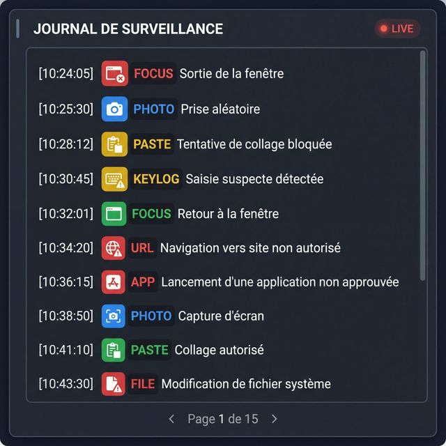

# 📘 Guide de l'Enseignant : Éditeur AntiPlagiat Sécurisé

Ce guide est conçu pour vous aider à comprendre et à utiliser rapidement l'**Éditeur AntiPlagiat** au sein de vos activités Moodle. Cet outil permet de sécuriser les évaluations de rédaction en surveillant l'intégrité du travail de l'étudiant en temps réel.

---

## 1. Accueil et Récupération de Session
Lorsqu'un étudiant lance l'activité, le système vérifie si une session a été interrompue (coupure internet, fermeture accidentelle).

**Nouveauté : Récupération Robuste**
*   **Session en cours** : Si un travail non soumis est détecté, un bloc bleu s'affiche.
*   **Restaurer** : Permet de reprendre exactement là où l'étudiant s'était arrêté.
*   **Effacer** : Nettoie les données locales pour recommencer à zéro (ex: changement d'étudiant).

---

## 2. Étapes de Pré-vérification (Pre-flight)
Avant de pouvoir taper le moindre mot, l'étudiant doit compléter un parcours de vérification obligatoire.

**Les 3 étapes obligatoires :**
1.  **Identification** : Saisie du nom de l'étudiant.
2.  **Vérification Caméra** : Le système active la webcam pour s'assurer qu'elle fonctionne.
3.  **Partage d'Écran** : L'étudiant doit partager l'intégralité de son écran (ou de ses deux écrans) pour valider qu'un seul outil est utilisé.
4.  **Santé Système** : Un indicateur interne vérifie que le moteur de surveillance est actif. Si un bloqueur (Shields ou extension) bloque le script, le bouton restera bloqué par sécurité.

---

## 3. L'Interface de Rédaction & Mode Pause
L'éditeur offre une interface épurée, similaire à un traitement de texte moderne, mais entièrement contrôlée.

**Fonctions de contrôle :**
*   **Mode Pause** : L'enseignant peut autoriser une pause (ex: 5 minutes). Pendant ce temps, l'éditeur est masqué et verrouillé pour empêcher toute rédaction hors surveillance.
*   **Horloge & Compteur** : Visibles en permanence pour la gestion du temps et du volume de texte.
*   **Sauvegarde Furtive** : Le texte est enregistré localement toutes les 2 secondes en arrière-plan pour éviter toute perte de données.

---

## 4. Le Journal de Surveillance (Intégrité)
Chaque action suspecte est enregistrée de manière transparente dans l'onglet **Journal**.

**Événements surveillés en temps réel :**
*   **Sortie de fenêtre (Focus loss)** : Passage à un autre onglet ou application (marqué en rouge).
*   **Collages (Paste)** : Tentatives d'importation de texte externe (bloquées).
*   **Captures Automatiques** : Photos webcam et captures d'écran prises à intervalles réguliers.

---

## 5. Ressources Autorisées & Soumission
Deux ressources externes sont intégrées sans quitter l'interface : **Le Conjugueur** et **Usito**.

**Processus final :**
1.  L'étudiant soumet son travail.
2.  Le texte est verrouillé en **lecture seule**.
3.  Les données sont transmises au carnet de notes Moodle.
4.  L'étudiant peut exporter son travail en **PDF** pour preuve.

---

## 💡 Conseils pour l'Enseignant
*   **Vérification des notes** : Le texte et le journal sont stockés dans le champ `suspend_data` de votre rapport Moodle SCORM.
*   **Analyse du journal** : En cas de doute, vérifiez la fréquence des "Sorties de fenêtre" et les photos d'identification.
*   **Brave & Ad-Blockers** : Si un étudiant signale que le bouton "Démarrer" est bloqué, demandez-lui de **désactiver les boucliers (Shields)** ou de tester en navigation privée.

---
*Document mis à jour — Mars 2026 — Éditeur AntiPlagiat V2.5*
